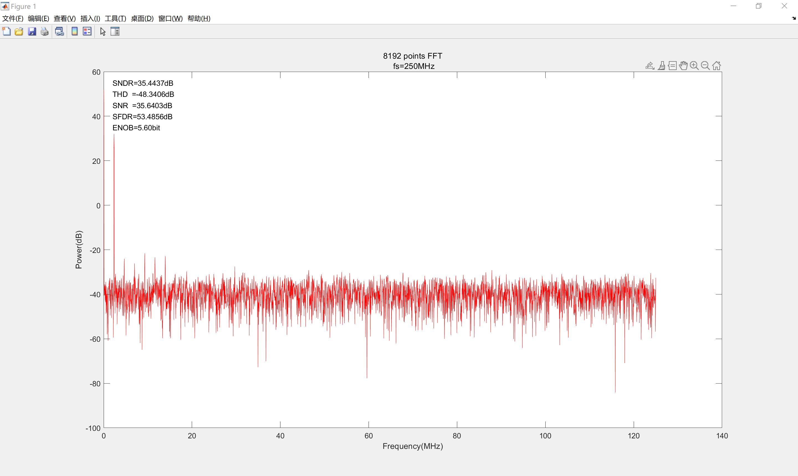

# 1.介绍

> 这个频谱仪是我专科的毕业设计。时间关系，实现的功能不多，也不是很理想，但为基于[Zynq-7000](https://china.xilinx.com/products/silicon-devices/soc/zynq-7000.html#productAdvantages)的简易频谱仪提供了设计原型。因此，你可以在此基础上继续完善，需要遵循GPL开源协议。

## 规格

* 软件: Vivado 2018.3 (或者更新的版本)、MATLAB 2022b (或者其他版本都可以，建议用新的哈)
* ADC: AD9481 (8bit, 250MSPS)
* Master: XC7Z035 (资源不要少于XC7Z020，除非减小FFT长度)
* FFT长度: 16384
* 输入: 0 ~1Vpp 单端输入+ 0.7V 直流偏置，频率：0.6 ~125MHz
* 显示: 1920*1080@60Hz，带HDMI接口的显示器
* 测量: 最大功率点自动追踪、手动光标测量，窗函数选择
* 控制: 按键、EC11编码器

## 结构

> 采用FPGA+ARM逻辑方案，PL完成ADC采样和FFT计算，然后将结果通过DMA传输到PS，最终ARM处理器与PL共同完成频谱显示及人机交互。窗函数系数可以用MATLAB生成。

系统总框图如下：

## 平台

> 开发板的资料可以从这里下载 [MILIANKE-F7-CZ06-7030开发平台-原型号MZ7030FA(ZYNQ)](https://www.uisrc.com/t-3268.html)。不过这个米联客的板子画的很烂，像刚会画PCB的新手直接去画这种复杂板，举个例子，下载器我每次都要降速才能连上芯片，vivado默认的15M根本连不上，所以啊极其不建议用。

## 视频

[视频](https://space.bilibili.com/1136023700)拍的不好，凑合看看hhhh。

# 2.ADC动态性能

> 由MATLAB计算的ADC几个动态性能指标。

# 3.已知问题

> 首先，开发板PCB画的太差了，难以保证信号完整性、电源完整性等等。其次，输入信号有特定要求，例如要加0.7V的直流偏置，这样实际应用价值就不大了。DMA传输也存在问题，前面几个数据没有正确传输到PS，所以大概0.6MHz以后才是对的。还有功率计算可能存在一些问题，显示窗口没有设计好，加窗后，噪底几乎看不到了。
