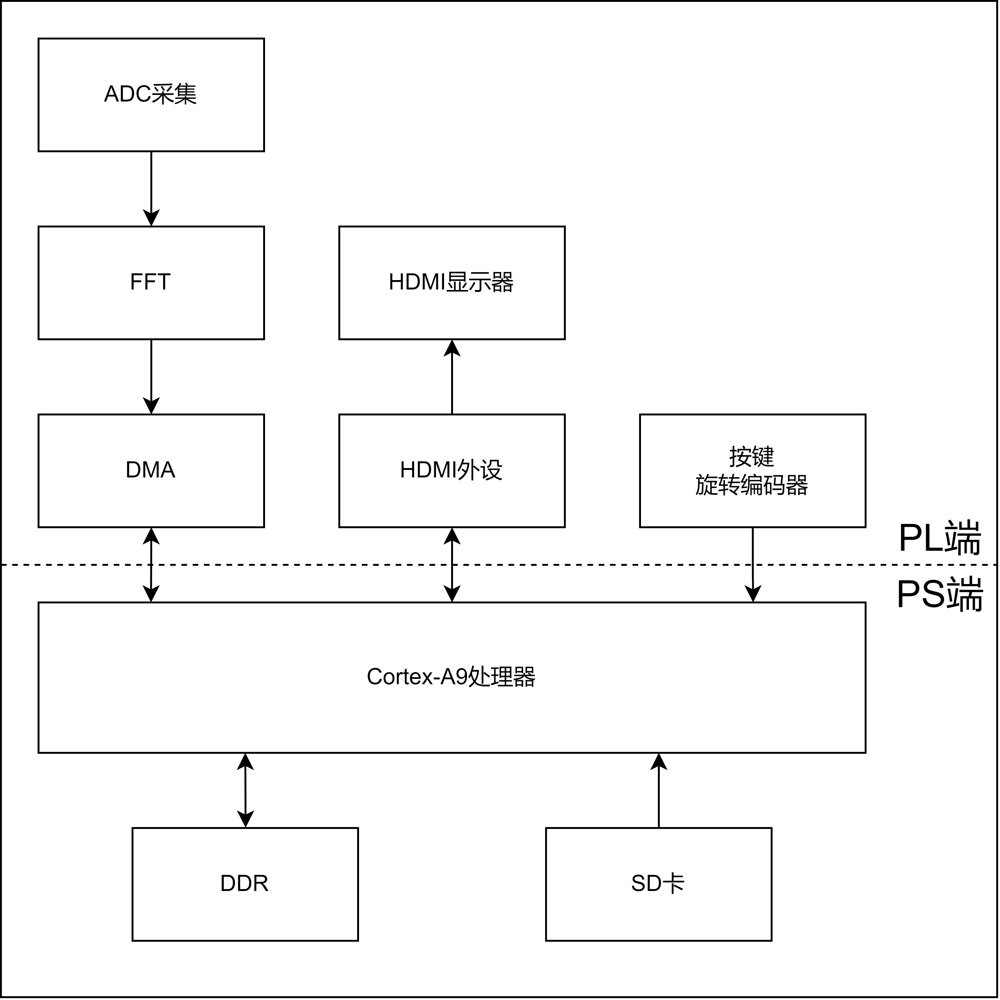
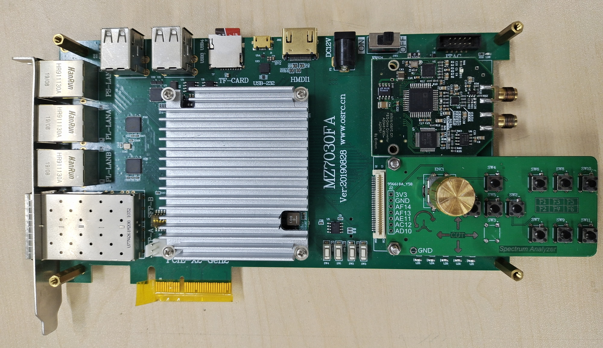
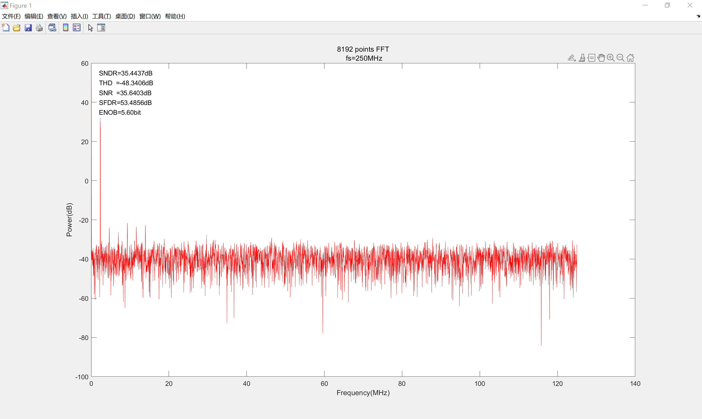

Hi, everyone! I'm from China, and not adept at English, so some mistakes maybe appear in this paper. Please forgive me! As you see, two languages are provided on the README for the convenience of friends at home and abroad.

# 1.Introduction

> The spectrum analayzer is my graduation project of the college. Lacking of time, it has a few functions, and not ideal, while it offer a prototype for the design of a sample  spectrometer based on [Zynq-7000](https://china.xilinx.com/products/silicon-devices/soc/zynq-7000.html#productAdvantages). Therefore, if you are not satisfied with this project, you can develop a new one on the basic of the current version, following the open source licence (GPL).

## Specifications

* Software: Vivado 2018.3 (or updated) and MATLAB 2022b (or other versions)
* ADC: AD9481 (8bit, 250MSPS)
* Master: XC7Z035 (not less than XC7Z020)
* Points of FFT: 16384
* Input: 0 ~1Vpp signle-ended with 0.7V DC offest, 0.6 ~125MHz
* Diplay: 1920*1080@60Hz monitor with HDMI port
* Measuring: automatically tracking maximum power, manual measurement by cursor, selecting window functions or no windows
* Control: tact switchs and a EC11 encoder

## Architecture

> Simply put, it is realized with FPGA+ARM standalone, where PL completes ADC sampling and FFT, then transforms the results to PS by DMA, and ARM processing unit cooperating with PL implements power spectrum display as well as man-machine interaction. Last, the window function coefficient is generated by MATLAB.

Here is the total block diagram of system.

## Platform

> As shown in the figure below, its resource can be download from [MILIANKE-F7-CZ06-7030开发平台-原型号MZ7030FA(ZYNQ)](https://www.uisrc.com/t-3268.html), which is producted by 米联客(uisrc). By the way, the layout of board is extremely poor, so I do advice that you use others or design one by youself.

## Video

For some reasons, the video hasn't been uploaded to YouTube yet, however, you can visit [a chinese website](https://space.bilibili.com/1136023700).

# 2.ADC dynamic performance

> ADC dynamic performance indexs have been calculated by MATLAB, as shown in the frigure.

# 3.Konwn Bugs

> First, as defective PCB design of the develop board, it is hard to assure the signal integrity (SI) or power integrity (PI) and so on. Secondly, input signal limited to the hardware is special, such as offest, in which case, the value of practical application dramatically decrecases. What's more, DMA transform has some problems, where the first few data is false, resulting that after about 0.6MHz, the power spectrum is ture. Finally, there maybe some mitstakes in the calculation of the spectrum, and display window is not designed well as the fact that the ground noise almost disappears, especially when interpolating window function.

# 4.Contact me

> If you have some problems or ideas, you can sen messages to my postbox: 3337194686@qq.com or ytingfeng263@gmail.com (I occasionally use gmail, so the first one is suggested).
